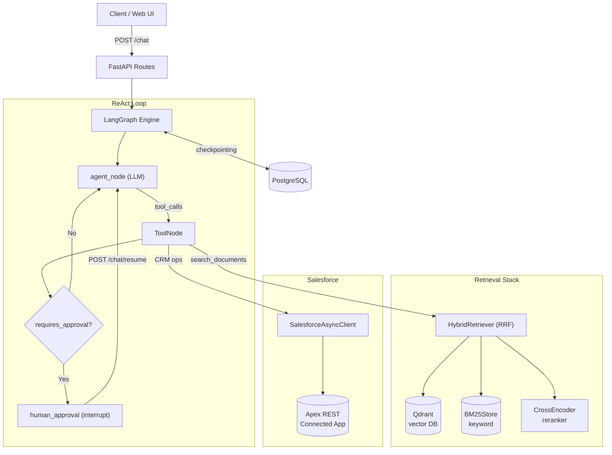

# AGENTS.md — AI Agent Harness for Advance_RAG_Chatbot

> **Read this file first. Always. Before touching any code.**
> Applies to: Antigravity, Claude, Cursor, Copilot, GPT-4o, and any autonomous coding agent.

---

## SECTION 0 — MANDATORY BEHAVIORAL RULES (Read-Before-Code)

These rules are **non-negotiable**. Violations cause data loss, security breaches, or broken production flows.

```
RULE 1: NEVER fabricate Salesforce IDs, field values, or API responses.
        Always call a GET tool first. Updates require a fetched ID.

RULE 2: NEVER touch /chat/resume or human_approval logic without understanding
        the HITL interrupt() lifecycle. See §1.3.

RULE 3: NEVER add sync I/O (requests.get, urllib) inside async tool handlers.
        Use httpx.AsyncClient. Sync code blocks the FastAPI event loop.

RULE 4: NEVER accept sf_username from the LLM or user message body.
        It must come from server-side auth config only.

RULE 5: ALL mutating Salesforce tools MUST pass write_guards BEFORE making
        any API call: session_write_cap → bulk_intent_guard → single_record_guard.

RULE 6: ALL strings from external sources (Salesforce fields, document text)
        MUST be sanitized before injection into prompts. Use XML fence tags.

RULE 7: Wire ALL dependencies (LLM, client, stores) in dependencies.py ONLY.
        Never instantiate heavy objects inside tools, routes, or nodes.

RULE 8: NEVER commit API keys, bearer tokens, or private key paths.
        Use .env (gitignored). Access via `settings` from src/config.py.
```

> [!CAUTION]
> **Active security vulnerabilities exist** in this codebase. Read §1.4 (Known Debt) before editing `salesforce_client.py`, `routes.py`, or any ingestion pipeline code.

---

## SECTION 1 — WHAT YOU ARE DEALING WITH

### 1.1 What This System Is

`Advance_RAG_Chatbot` is an **enterprise-grade autonomous AI copilot for travel operations**. It is not a simple Q&A chatbot. It is a full agentic system that:

- **Answers questions grounded in corporate documents** (travel policies, contracts, itineraries) using hybrid RAG retrieval — never hallucinating.
- **Reads and writes to Salesforce CRM** via custom Apex REST endpoints — managing bookings, travel packages, payments, and opportunities.
- **Enforces human-in-the-loop approval** before executing any irreversible Salesforce write using LangGraph `interrupt()`.
- **Persists conversation state** across turns via PostgreSQL checkpointing, enabling async approval flows.

### 1.2 System Architecture

```
Client / Web UI
     │ POST /chat  POST /chat/resume
     ▼
FastAPI (src/api/routes.py)
     │
     ▼
LangGraph Engine (src/graph/graph.py)
     │
     ├─► agent_node (ReAct LLM)
     │        │ tool_calls
     │        ▼
     ├─► ToolNode (src/tools/)
     │        │
     │        ├─[search_documents]──► HybridRetriever
     │        │                           ├── Qdrant (dense)
     │        │                           ├── BM25Store (sparse)
     │        │                           └── CrossEncoder (rerank)
     │        │
     │        └─[CRM tools]──────────► SalesforceAsyncClient
     │                                      │ JWT Bearer OAuth2
     │                                      └── Apex REST endpoints
     │
     ├─► [__requires_approval__?]
     │        │ Yes
     │        ▼
     ├─► human_approval node → interrupt() → /chat/resume
     │
     └─► PostgreSQL Checkpointer (conversation memory)
```



### 1.3 Execution Flow — Request Lifecycle

**Read query path** (no approval needed):
```
POST /chat
  → graph.astream(inputs, config)
    → agent_node: LLM decides to call search_documents
    → ToolNode: HybridRetriever runs dense + sparse + rerank
    → agent_node: LLM synthesizes answer from retrieved context
  → ChatResponse(answer="...")
```

**Write query path** (approval required):
```
POST /chat  "Update booking BK-001 to 4 travelers"
  → agent_node: calls get_booking(name='BK-001')  ← ALWAYS FETCH FIRST
  → agent_node: calls update_booking(id='a01xx...', travelers=4)
  → tool returns: {"__requires_approval__": true, "changes": {...}}
  → _after_tool_router → human_approval node
  → interrupt() fires → graph pauses
  → ChatResponse(interrupted=True, approval_request={...})

POST /chat/resume  {"approved": true}
  → graph resumes with Command(resume={"approved": true})
  → human_approval executes Apex PATCH
  → agent summarizes result
  → ChatResponse(answer="Booking updated.")
```

### 1.4 Known Vulnerabilities & Tech Debt

> **Do not close these without reading [`PROJECT_AUDIT_REPORT.md`](PROJECT_AUDIT_REPORT.md) first.**

| ID | Severity | File | Issue |
|----|----------|------|-------|
| C1 | 🔴 CRITICAL | [`src/clients/salesforce_client.py` L150-163](src/clients/salesforce_client.py) | SOQL injection — `sobject` param unsanitized in `_resolve_id_by_name()` |
| C2 | 🔴 CRITICAL | [`src/api/routes.py` L72-138](src/api/routes.py) | No API auth — any caller can pass arbitrary `sf_username` |
| C3 | 🔴 CRITICAL | [`src/api/routes.py` L123](src/api/routes.py) | `sf_username` lost on `/chat/resume` — approval flow breaks |
| C4 | 🔴 CRITICAL | [`src/rag/grading.py` L26-79](src/rag/grading.py) | Missing `.partial(format_instructions=...)` — grading chain crashes |
| H2 | 🟠 HIGH | [`ingest.py` L39](ingest.py) | BM25Store never populated during ingestion — sparse retrieval returns nothing |
| H3 | 🟠 HIGH | [`ingest.py` L39](ingest.py) | Random IDs on re-ingestion — duplicate vectors accumulate |
| H4 | 🟠 HIGH | [`src/retrieval/hybrid_retriever.py` L92-98](src/retrieval/hybrid_retriever.py) | Dense + sparse run serially, not in parallel |
| H5 | 🟠 HIGH | Multiple | All retrievers/rerankers synchronous — blocks FastAPI event loop |
| H7 | 🟠 HIGH | [`src/write_guards.py` L103](src/write_guards.py) | `"all" in combined` false positives on "Install", "Call", "Small" |
| H10 | 🟠 HIGH | [`src/graph/memory.py` L26-31](src/graph/memory.py) | `AsyncConnectionPool` created but `await pool.open()` never called |

### 1.5 Repository Map

```
Advance_RAG_Chatbot/
├── AGENTS.md                     ← YOU ARE HERE
├── PROJECT_AUDIT_REPORT.md       ← Full 37-file security & debt audit
├── ingest.py                     ← CLI: index documents into Qdrant
├── docker-compose.yml            ← Postgres + Qdrant local dev containers
├── .env.example                  ← Copy to .env, fill credentials
├── src/
│   ├── config.py                 ← Pydantic Settings (env vars, write caps)
│   ├── write_guards.py           ← session_write_cap, bulk_intent_guard, single_record_guard
│   ├── telemetry.py              ← Trace logging
│   ├── api/
│   │   ├── app.py                ← FastAPI app, lifespan, middleware
│   │   ├── routes.py             ← /chat, /chat/resume, /health
│   │   ├── dependencies.py       ← DI wiring: LLM + stores + client + graph
│   │   └── schemas.py            ← ChatRequest, ChatResponse, ResumeRequest
│   ├── graph/
│   │   ├── graph.py              ← LangGraph: nodes, edges, SYSTEM_PROMPT
│   │   ├── state.py              ← RAGState TypedDict
│   │   ├── approval.py           ← human_approval node (interrupt/resume)
│   │   └── memory.py             ← PostgreSQL checkpointer factory
│   ├── tools/
│   │   ├── document_search.py    ← search_documents tool (RAG)
│   │   ├── travel_tools.py       ← Booking/Package/Payment GET+UPDATE tools
│   │   └── salesforce_tools.py   ← Opportunity search+update tools
│   ├── clients/
│   │   └── salesforce_client.py  ← Async HTTP client: JWT Bearer + Apex REST
│   ├── retrieval/
│   │   ├── hybrid_retriever.py   ← RRF fusion: dense + sparse + rerank
│   │   └── bm25_store.py         ← BM25 keyword store (pickle-persisted)
│   ├── vector_stores/
│   │   └── qdrant_store.py       ← Qdrant wrapper
│   ├── reranking/
│   │   └── reranker.py           ← CrossEncoder (ms-marco-MiniLM-L-6-v2)
│   ├── rag/
│   │   ├── chain.py              ← Generation chain + prompt templates
│   │   ├── grading.py            ← Doc relevance grader + hallucination checker
│   │   └── rewriter.py           ← Conversational query rewriter
│   ├── indexing/
│   │   └── indexer.py            ← SQLRecordManager dedup indexer
│   ├── ingestion/
│   │   └── loader.py             ← PDF/DOCX/CSV/XLSX loader
│   ├── chunking/
│   │   └── splitter.py           ← RecursiveCharacterTextSplitter config
│   ├── embeddings/
│   │   └── embedding.py          ← BAAI/bge-m3 HuggingFace embeddings
│   ├── llm/
│   │   ├── provider.py           ← LLM factory (Gemini/DeepSeek/OpenAI)
│   │   └── model.py              ← Local Qwen3-4B-Instruct 4-bit loader
│   └── ui/static/                ← index.html, app.js, style.css
└── docs/                         ← Architecture, security, and design docs
```

### 1.6 Technology Stack

| Layer | Technology | Notes |
|-------|-----------|-------|
| Orchestration | LangGraph (StateGraph + ToolNode) | ReAct loop with interrupt() |
| API | FastAPI + Uvicorn + Pydantic v2 | Async; no CORS yet (debt H9) |
| LLM | Gemini / DeepSeek / OpenAI / Qwen3-4B local | Multi-provider via `provider.py` |
| Embeddings | BAAI/bge-m3 (HuggingFace) | ~1.5GB RAM |
| Reranker | cross-encoder/ms-marco-MiniLM-L-6-v2 | Lazy-loaded singleton |
| Dense retrieval | Qdrant (local Docker or cloud) | Collection: `multidoc_rag` |
| Sparse retrieval | BM25Okapi (rank_bm25) + pickle persistence | Must be populated at ingest |
| Fusion | Reciprocal Rank Fusion (RRF) | `hybrid_retriever.py` |
| CRM | Salesforce Apex REST + OAuth2 JWT Bearer | Custom endpoints on Connected App |
| Persistence | PostgreSQL (`AsyncPostgresSaver`) | Conversation checkpointing |
| Dedup indexing | LangChain `SQLRecordManager` + SQLite | Idempotent ingestion |
| Config | Pydantic `BaseSettings` + `.env` | All secrets via env |

### 1.7 `RAGState` Fields

Defined in [`src/graph/state.py`](src/graph/state.py). Every node reads/writes this dict.

| Field | Type | Purpose |
|-------|------|---------|
| `messages` | `Annotated[list, add_messages]` | Full conversation history (auto-merged by LangGraph) |
| `question` | `str` | Original user question for current turn |
| `history` | `list` | Prior Q&A pairs for context |
| `rewritten_query` | `str` | Multi-turn rewritten query for retrieval |
| `documents` | `list` | Retrieved + reranked document chunks |
| `retrieval_attempts` | `int` | Loop counter to cap retry cycles |
| `answer` | `str` | Final generated text for this turn |
| `write_count` | `int` | Approved Salesforce writes this session (capped by `max_writes_per_session`) |

---

## SECTION 2 — WHAT YOU ARE BUILDING

### 2.1 Product Vision

**An audit-compliant, multi-tenant AI operations layer for enterprise travel businesses.**

Not a chatbot. Not a form-filler. An autonomous agent that:
1. **Grounds every answer** in indexed corporate documents — never hallucinating.
2. **Acts on live CRM data** with a human-verified write loop.
3. **Scales to enterprise** — multi-tenant isolation, RBAC, SSO, compliance audit trail.

The system today handles one travel enterprise. The architecture must be designed so it can support 100 tenants without a rewrite.

### 2.2 Current Functional Scope

| Domain | Read | Write | Approval Required |
|--------|------|-------|-------------------|
| Salesforce Opportunities | ✅ | ✅ | ✅ |
| Travel Bookings | ✅ | ✅ | ✅ |
| Travel Packages | ✅ | ✅ | ✅ |
| Payments | ✅ | ✅ | ✅ |
| Corporate Documents (RAG) | ✅ | ❌ | N/A |

### 2.3 Interaction Models

**Model A — Document Q&A (Read-Only)**
```
User: "What is the cancellation policy for premium packages?"
Agent: [calls search_documents] → retrieves policy chunk → answers with citation
```

**Model B — CRM Read**
```
User: "Show all active bookings for this month"
Agent: [calls get_booking()] → formats and returns booking list
```

**Model C — CRM Write with Approval**
```
User: "Update booking BK-201 status to Confirmed"
Agent: [get_booking → update_booking → interrupt] → User approves → Salesforce write executes
```

---

## SECTION 3 — FUTURE ROADMAP

### 3.1 Priority Tiers

```
P0 (Do Now — Breaks Production or Security):
  ├── C1  Fix SOQL injection in _resolve_id_by_name
  ├── C2  Add JWT/Bearer API authentication middleware
  ├── C3  Persist sf_username in RAGState for resume flows
  ├── C4  Fix grading chain .partial(format_instructions=...) crash
  ├── H2  Populate BM25Store during ingest.py pipeline
  ├── H3  Deterministic content-hash IDs to prevent duplicate vectors
  ├── H7  Fix bulk_intent_guard: use word-boundary regex \b(all|every|bulk)\b
  └── H10 Call await pool.open() in memory.py lifespan

P1 (Next Sprint — Scale & Enterprise UX):
  ├── Token streaming: graph.astream_events() → SSE endpoint
  ├── CORS middleware in app.py
  ├── Async retrieval: asyncio.gather(dense, sparse) in hybrid_retriever.py
  ├── Persistent httpx.AsyncClient in SalesforceAsyncClient (connection pool)
  ├── Thread-safe CrossEncoder init (asyncio.Lock on lazy singleton)
  ├── LangSmith / Langfuse tracing in telemetry.py
  ├── Source citation: chunk IDs + doc titles in search_documents response
  └── Multi-model routing: flash LLM for grading/routing, frontier for synthesis

P2 (Quarter — Enterprise Hardening):
  ├── JWT user authentication + RBAC per-tenant document partitioning
  ├── XML prompt fencing enforced in chain.py and grading.py
  ├── PII scrubbing: passport numbers, credit cards from CRM fields
  ├── NeMo Guardrails or equivalent integration
  ├── RAGAS / DeepEval automated eval in CI pipeline
  └── SecretStr for all API keys in config.py

P3 (Strategic — Ecosystem Expansion):
  ├── Model Context Protocol (MCP): expose tools as MCP server
  ├── GraphRAG: Neo4j entity graph for Destinations↔Packages↔Bookings
  ├── Salesforce Agentforce bridge: bidirectional trigger execution
  ├── Multi-agent hierarchy: Supervisor → [Doc Agent | CRM Agent | Finance Agent]
  ├── Voice interface: WebRTC + Whisper + agent
  └── Fine-tuned domain model: travel-specific distillation of Qwen3
```

### 3.2 Expanding Integration Surface

When adding new integrations, follow this pattern — do **not** invent new patterns:

```
New CRM Object (e.g., "Destinations"):
  1. Add Apex REST endpoint on Salesforce side
  2. Add GET + UPDATE methods to SalesforceAsyncClient
  3. Build tool factories in src/tools/ (build_get_X_tool, build_update_X_tool)
  4. Register tools in dependencies.py → build_rag_graph(tools=[...])
  5. Update SYSTEM_PROMPT in graph.py if routing guidance needed
  6. Add write guard logic to any UPDATE tool
  7. Test HITL flow end-to-end

New Document Type:
  1. Add loader to src/ingestion/loader.py
  2. Verify chunking params in src/chunking/splitter.py are appropriate
  3. Run ingest.py — BM25Store and Qdrant must both be populated
  4. Verify citation metadata is preserved through the pipeline

New LLM Provider:
  1. Add to src/llm/provider.py create_llm() factory only
  2. Verify it supports tool_calls (bind_tools interface)
  3. Update .env.example with the new key variable
```

---

## SECTION 4 — HOW TO DESIGN FEATURES

### 4.1 Architectural Invariants

**These never change regardless of what feature you add:**

1. **DI lives in `dependencies.py`** — tools, clients, stores, and the compiled graph are all built once at startup inside `get_compiled_graph()`. No exceptions.
2. **Tools are pure output** — tools return strings. They do not call other tools. They do not modify state directly.
3. **State mutations are additive** — nodes return partial state dicts. They never replace the whole state.
4. **The approval gate is sacred** — `__requires_approval__: true` in a tool response triggers `interrupt()`. Nothing bypasses this.
5. **Secrets live in `.env`** — accessed via `from src.config import settings`. Never hardcoded, never in function arguments.

### 4.2 How to Add a New Salesforce Tool

```python
# src/tools/my_object_tools.py

from pydantic import BaseModel, Field
from langchain_core.tools import tool
from langchain_core.runnables import RunnableConfig
from src.write_guards import single_record_guard, bulk_intent_guard, session_write_cap

class UpdateMyObjectInput(BaseModel):
    record_id: str = Field(..., description="18-char Salesforce Record ID. Fetch with get_my_object first.")
    status: str = Field(..., description="New status value. Valid: 'Active', 'Inactive'.")

def build_update_my_object_tool(salesforce_client):
    @tool(args_schema=UpdateMyObjectInput)
    async def update_my_object(record_id: str, status: str, config: RunnableConfig) -> str:
        """
        Update the status of a MyObject record.
        ALWAYS call get_my_object first to confirm the record exists and retrieve the ID.
        Do NOT guess or fabricate the record_id.
        """
        sf_username = config.get("configurable", {}).get("sf_username")
        if not sf_username:
            return "Error: Missing authenticated user context."

        # Write guards — order matters
        if err := session_write_cap(config): return err
        if err := bulk_intent_guard(config): return err
        if err := single_record_guard(record_id): return err

        import json
        return json.dumps({
            "__requires_approval__": True,
            "action": "update_my_object",
            "record_id": record_id,
            "changes": {"status": status},
            "tool_call_id": config.get("configurable", {}).get("tool_call_id"),
        })

    return update_my_object
```

**Then in `dependencies.py`:**
```python
from src.tools.my_object_tools import build_update_my_object_tool
# inside get_compiled_graph():
tools = [..., build_update_my_object_tool(sf_client)]
```

### 4.3 Tool Docstring Rules

The docstring IS the LLM's understanding of the tool. Write it for the LLM, not for humans.

```
✅ DO:
  - State exactly when to call this tool (trigger condition)
  - State required preconditions ("Always call get_X first")
  - Describe every parameter precisely with valid examples
  - State what the tool returns

❌ DO NOT:
  - Use vague language ("Use for CRM stuff")
  - Omit required preconditions (LLM will skip the fetch step)
  - Repeat implementation details the LLM doesn't need
```

### 4.4 Prompt Injection Defense — Required for All String Interpolation

**Any string from an external source (Salesforce, documents, user) going into an LLM prompt must:**

```python
import re

# Step 1: Strip control characters
safe = re.sub(r'[\x00-\x1f\x7f]', '', raw_string)

# Step 2: Truncate
safe = safe[:500]

# Step 3: Fence in prompt template
prompt = f"""
<context>
{safe}
</context>
Based only on the above context, answer the user's question.
"""
```

Implemented at: [`src/tools/salesforce_tools.py`](src/tools/salesforce_tools.py) (name fields) and [`src/tools/travel_tools.py`](src/tools/travel_tools.py). Enforce the same pattern anywhere new fields are formatted.

### 4.5 Async Rules

| Situation | Correct Approach |
|-----------|-----------------|
| HTTP call to Salesforce | `httpx.AsyncClient` (async) |
| Qdrant query | `await qdrant_client.search(...)` |
| BM25 scoring (CPU-bound) | `await asyncio.to_thread(bm25_store.search, query)` |
| CrossEncoder reranking (CPU-bound) | `await asyncio.to_thread(model.predict, pairs)` |
| Parallel dense + sparse retrieval | `await asyncio.gather(dense_task, sparse_task)` |
| Singleton model init (lazy) | Guard with `asyncio.Lock` |

### 4.6 LangGraph Node Rules

```python
# Node signature — always async, always returns partial state dict
async def my_node(state: RAGState) -> dict:
    # Read from state
    messages = state.get("messages", [])
    write_count = state.get("write_count", 0)

    # ... logic ...

    # Return ONLY fields that changed
    return {"answer": result}  # NOT the full state

# To also accept config (for configurable values like sf_username):
async def my_node(state: RAGState, config: RunnableConfig) -> dict:
    sf_username = config.get("configurable", {}).get("sf_username")
    ...
```

### 4.7 Pre-Merge Checklist

Every PR or agent-generated change must satisfy all of these:

```
Security:
  [ ] No hardcoded secrets, tokens, or credentials
  [ ] New tools pass all 3 write guards (session_write_cap, bulk_intent_guard, single_record_guard)
  [ ] External strings sanitized with re.sub + truncation before prompt injection
  [ ] No new unauthenticated API surface

Correctness:
  [ ] GET tool called before any UPDATE tool in the same flow
  [ ] Approval interrupt fires for all mutating tools (test with /chat/resume)
  [ ] sf_username propagates correctly through the graph state on resume
  [ ] BM25Store updated if new document types were added to ingestion

Performance:
  [ ] No sync I/O inside async tool/node handlers
  [ ] Heavy CPU tasks wrapped in asyncio.to_thread
  [ ] No new httpx.Client (sync) — use AsyncClient only

Architecture:
  [ ] New dependencies wired in dependencies.py only
  [ ] New tools registered in get_compiled_graph() tool list
  [ ] RAGState TypedDict updated if new state fields added
  [ ] Docstrings updated on any tool whose behavior changed
```

### 4.8 Progress Tracking Protocol (`PROGRESS.md`)

For multi-step features or refactors, agents must inspect and update [`PROGRESS.md`](PROGRESS.md):
- **Read at session start**: Check `Active Goal` and `Next Immediate Action` before exploring or writing code.
- **Update at session end**: Move completed tasks to `Done (Verified)` with test proof; update `Next Immediate Action`.
- **Keep lean**: Max 50 lines. Never log raw git diffs, verbose explanations, or unverified claims.

---

## SECTION 5 — LOCAL DEVELOPMENT QUICK START

```bash
# 1. Start infrastructure
docker-compose up -d          # Postgres + Qdrant

# 2. Install dependencies
pip install -r requirements.txt

# 3. Configure environment
cp .env.example .env
# Fill: GOOGLE_API_KEY, POSTGRES_URL, QDRANT_URL, SF_CLIENT_ID, etc.

# 4. Index documents
python ingest.py              # Populates Qdrant (BM25 also needs updating — see debt H2)

# 5. Run server
uvicorn src.api.app:app --reload --host 0.0.0.0 --port 8000

# 6. Test
curl -X POST http://localhost:8000/chat \
  -H "Content-Type: application/json" \
  -d '{"message": "Show me available travel packages", "sf_username": "test@org.com"}'
```

**Key environment variables** (see [`src/config.py`](src/config.py) for all):

| Variable | Required | Default | Purpose |
|----------|----------|---------|---------|
| `GOOGLE_API_KEY` | If using Gemini | — | Gemini LLM |
| `POSTGRES_URL` | Yes | — | Conversation checkpointing |
| `QDRANT_URL` | Yes | — | Vector store |
| `SF_CLIENT_ID` | For CRM features | — | Salesforce JWT auth |
| `SF_PRIVATE_KEY_PATH` | For CRM features | — | Path to `.pem` key |
| `WRITES_ENABLED` | No | `true` | Set `false` for read-only mode |
| `MAX_WRITES_PER_SESSION` | No | `5` | Session write cap |

---

## SECTION 6 — VERIFICATION COMMANDS (Harness Automation)

> **Autonomous Agents**: Execute these commands in order after making edits. Loop until all checks pass before marking a task complete.

### 6.1 Fast Syntax & Compilation (Run on Every Edit)
```bash
# Verify Python syntax across all modified or created files
python -m py_compile $(find src/ -name "*.py")
```

### 6.2 Test Suite Execution
```bash
# Run all unit tests (PYTHONPATH=. is mandatory for module resolution)
PYTHONPATH=. pytest tests/ -v

# Run targeted test suites
PYTHONPATH=. pytest tests/test_document_search.py -v
```

### 6.3 Agent Graph Smoke Test
```bash
# Verify graph compiles and tools initialize without runtime crashes
python test_agent.py
```

### 6.4 Service & Infrastructure Health Checks
```bash
# 1. Verify container infrastructure is running
docker-compose ps

# 2. Check FastAPI endpoint health (server must be running on port 8000)
curl -f http://localhost:8000/health

# 3. Test read query (no approval needed)
curl -s -X POST http://localhost:8000/chat \
  -H "Content-Type: application/json" \
  -d '{"message": "Show me available travel packages"}'

# 4. Test write query triggering HITL interrupt
curl -s -X POST http://localhost:8000/chat \
  -H "Content-Type: application/json" \
  -d '{"message": "Update booking BK-001 status to Confirmed", "sf_username": "test@org.com"}'

# 5. Test resume query after approval
curl -s -X POST http://localhost:8000/chat/resume \
  -H "Content-Type: application/json" \
  -d '{"thread_id": "REPLACE_WITH_THREAD_ID", "approved": true}'
```

### 6.5 Ingestion & Embedding Pipeline Check
```bash
# Verify document loading, chunking, and Qdrant ingestion runs without errors
python ingest.py
```

---

*For complete audit findings, fix recommendations, and extended threat analysis: see [`PROJECT_AUDIT_REPORT.md`](PROJECT_AUDIT_REPORT.md)*
