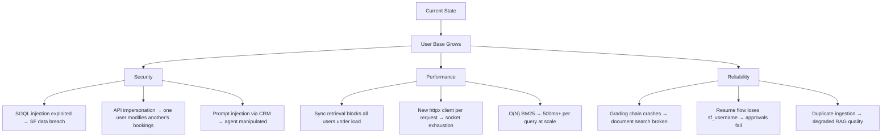
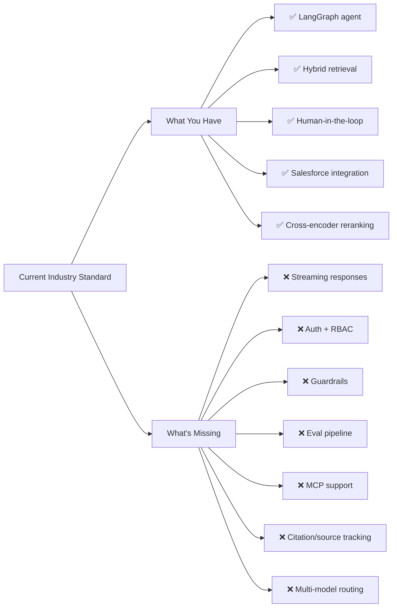

# Advance RAG Chatbot — Full Project Audit Report

> Audit of **37 files** across infrastructure, RAG pipeline, agent graph, API, Salesforce integration, and DevOps layers.
> Organized by the 4 questions you asked.

---

## Table of Contents

1. [Critical & High Issues — What and Why](#1-critical--high-issues--what-and-why)
2. [Approaches to Fix — Pros & Cons](#2-approaches-to-fix--pros--cons)
3. [Effect on Project in Near Future](#3-effect-on-project-in-near-future)
4. [What to Add Next — Industry Demand & Top Org Trends](#4-what-to-add-next--industry-demand--top-org-trends)

---

## 1. Critical & High Issues — What and Why

### 🔴 CRITICAL (Will break production or cause data breach)

| # | Issue | File(s) | Why It Matters |
|---|-------|---------|----------------|
| C1 | **SOQL Injection** — `_resolve_id_by_name` builds queries via string interpolation. `sobject` param is unvalidated, `name` escaping is bypassable. | [`salesforce_client.py` L150-163](file:///home/akhilsaini/Advance_RAG_Chatbot/src/clients/salesforce_client.py#L150-L163) | Attacker can read/modify any Salesforce record by injecting SOQL through a booking name or payment reference. |
| C2 | **Zero authentication on API** — No auth on `/chat` or `/chat/resume`. Any client can pass arbitrary `sf_username` (impersonation) or access any `thread_id` (session hijack). | [`routes.py` L72-138](file:///home/akhilsaini/Advance_RAG_Chatbot/src/api/routes.py#L72-L138) | Complete impersonation. User A can resume User B's approval flow and execute Salesforce writes on their behalf. |
| C3 | **`sf_username` lost on resume** — `/chat/resume` rebuilds config without `sf_username`. Subsequent SF tool calls fail. | [`routes.py` L123](file:///home/akhilsaini/Advance_RAG_Chatbot/src/api/routes.py#L123) | Approval flow always fails after user clicks "Approve" — the approved write cannot execute. |
| C4 | **`format_instructions` crash** — Retrieval grader prompt requires `{format_instructions}` placeholder but it's never set via `.partial()`. | [`grading.py` L26-79](file:///home/akhilsaini/Advance_RAG_Chatbot/src/rag/grading.py#L26-L79) | `KeyError` crash every time grading chain is invoked. Document search tool breaks entirely. |
| C5 | **Invalid default model IDs** — `"gemini-3.6-flash"` and `"deepseek-flash"` don't exist. | [`provider.py` L13-15](file:///home/akhilsaini/Advance_RAG_Chatbot/src/llm/provider.py#L13-L15) | 400/404 API errors on startup if using defaults. |

---

### 🟠 HIGH (Significant reliability, security, or performance risk)

| # | Issue | File(s) | Why It Matters |
|---|-------|---------|----------------|
| H1 | **New httpx client per request** — 10 Salesforce methods each create `httpx.AsyncClient()`, causing repeated TLS handshakes. | [`salesforce_client.py`](file:///home/akhilsaini/Advance_RAG_Chatbot/src/clients/salesforce_client.py) (10 methods) | Under 50 req/s: ~150ms extra latency per call + socket exhaustion risk. |
| H2 | **BM25 index never populated** — `ingest.py` writes only to Qdrant. `BM25Store()` starts empty at boot. Hybrid retriever's sparse half returns nothing. | [`ingest.py` L39](file:///home/akhilsaini/Advance_RAG_Chatbot/ingest.py#L39), [`dependencies.py` L118](file:///home/akhilsaini/Advance_RAG_Chatbot/src/api/dependencies.py#L118) | RRF fusion degrades to pure dense retrieval. Keyword-heavy queries (names, codes, IDs) miss documents. |
| H3 | **Duplicate vectors on re-ingestion** — `ingest.py` generates random IDs. Running it twice doubles every document. | [`ingest.py` L39](file:///home/akhilsaini/Advance_RAG_Chatbot/ingest.py#L39) | Retrieval returns duplicate chunks → inflated context → wasted tokens → confused LLM answers. |
| H4 | **Sequential hybrid retrieval** — Dense + sparse run serially instead of in parallel. | [`hybrid_retriever.py` L92-98](file:///home/akhilsaini/Advance_RAG_Chatbot/src/retrieval/hybrid_retriever.py#L92-L98) | 200ms+ retrieval latency instead of ~150ms. Multiplied by every user query. |
| H5 | **No async anywhere** — Retriever, reranker, embedder, and BM25 all synchronous. Block FastAPI's event loop. | Multiple files | Under concurrent load, one slow LLM call blocks ALL other users' requests. |
| H6 | **Prompt injection via raw context** — Retrieved document content injected directly into LLM prompts without XML fencing or escaping. | [`chain.py` L25-36](file:///home/akhilsaini/Advance_RAG_Chatbot/src/rag/chain.py#L25-L36), [`grading.py` L56-68](file:///home/akhilsaini/Advance_RAG_Chatbot/src/rag/grading.py#L56-L68) | Adversarial document content (e.g. a PDF containing "Ignore previous instructions") can hijack LLM behaviour. |
| H7 | **`bulk_intent_guard` false positives** — Substring match `"all" in combined` triggers on words like "Install", "Call", "Small". | [`write_guards.py` L103](file:///home/akhilsaini/Advance_RAG_Chatbot/src/write_guards.py#L103) | Legitimate single-record updates blocked. Users can't update a booking with "Small group" in the notes. |
| H8 | **API keys as plain `str`** — Secrets visible in logs, `repr()`, error tracebacks, and model dumps. | [`config.py` L5-19](file:///home/akhilsaini/Advance_RAG_Chatbot/src/config.py#L5-L19) | Any unhandled exception or debug log leaks API keys. |
| H9 | **Missing CORS middleware** — No `CORSMiddleware`. Frontend web clients blocked. | [`app.py` L59-66](file:///home/akhilsaini/Advance_RAG_Chatbot/src/api/app.py#L59-L66) | Web UI cannot communicate with API from browser. |
| H10 | **Unmanaged Postgres connection pool** — `AsyncConnectionPool` created but never `await pool.open()`. | [`memory.py` L26-31](file:///home/akhilsaini/Advance_RAG_Chatbot/src/graph/memory.py#L26-L31) | Connection pool exhaustion → graph checkpointing silently fails → conversation history lost. |
| H11 | **Cross-tenant document exposure** — No `metadata_filter` on document search. | [`document_search.py` L35](file:///home/akhilsaini/Advance_RAG_Chatbot/src/tools/document_search.py#L35), [`nodes.py` L327](file:///home/akhilsaini/Advance_RAG_Chatbot/src/graph/nodes.py#L327) | User A's queries return User B's private documents. |
| H12 | **CRM field prompt injection** — Booking names, destinations, notes injected into LLM context without sanitization. | [`travel_tools.py` L23-73](file:///home/akhilsaini/Advance_RAG_Chatbot/src/tools/travel_tools.py#L23-L73) | Malicious Salesforce record content can manipulate agent behaviour. |
| H13 | **Path traversal in file loader** — No sandboxing on `load_file()`. Can read any local file. | [`loader.py` L20-63](file:///home/akhilsaini/Advance_RAG_Chatbot/src/ingestion/loader.py#L20-L63) | If ingestion path is user-controllable, attacker reads `/etc/passwd` or `.env`. |
| H14 | **Race condition in reranker model load** — No thread lock on lazy `CrossEncoder` initialization. | [`reranker.py` L66-76](file:///home/akhilsaini/Advance_RAG_Chatbot/src/reranking/reranker.py#L66-L76) | Concurrent startup requests load multiple copies of ~1GB model → OOM crash. |
| H15 | **O(N) BM25 linear scan** — Computes score against every document for every query. No inverted index. | [`bm25_store.py` L104-114](file:///home/akhilsaini/Advance_RAG_Chatbot/src/retrieval/bm25_store.py#L104-L114) | At 100K docs: ~500ms per BM25 query. At 1M docs: unusable. |

---

### 🟡 MEDIUM Issues (Summarized)

| Area | Count | Key Examples |
|------|-------|-------------|
| Missing validation | 6 | No `max_length` on question field, no date format validation on update tools, unconstrained config thresholds |
| Brittle exception handling | 4 | String-sniffing `"'dict' object" in str(e)` across 4 files |
| Dead/orphaned code | 3 | `nodes.py` is entirely unused by `graph.py`, dead `as_dynamic_runnable` in reranker, unused `ModelProviderError` |
| Hardcoded config | 5 | Chunk size 1000, collection "multidoc_rag", embedding model, Qdrant data dir, BM25 store path |
| Missing cleanup/lifecycle | 3 | No shutdown hooks for DB pools, HTTP clients, model memory |
| Token concurrency races | 2 | SF token cache without `asyncio.Lock`, BM25 store without `threading.Lock` |

---

## 2. Approaches to Fix — Pros & Cons

### Tier 1 — Fix Immediately (Security + Crashes)

#### C1: SOQL Injection Fix

| Approach | Pros | Cons |
|----------|------|------|
| **A: Use Salesforce REST API query with bind variables** (recommended) | Eliminates injection entirely; Salesforce handles escaping | Requires Apex endpoint changes to accept parameterized queries |
| **B: Allowlist `sobject` + proper SOQL escaping** | No Apex changes needed; quick fix | Must maintain allowlist; escaping is error-prone across Unicode |

#### C2: API Authentication

| Approach | Pros | Cons |
|----------|------|------|
| **A: JWT/OAuth2 middleware** (recommended for production) | Industry standard; works with Salesforce SSO; stateless | Setup complexity; token refresh logic needed |
| **B: API key header validation** | Simple; fast to implement | Not user-scoped; shared secret = single point of failure |
| **C: Session-based auth** | Familiar pattern; easy frontend integration | Requires session store; doesn't scale horizontally without Redis |

#### C3: `sf_username` on Resume

| Approach | Pros | Cons |
|----------|------|------|
| **A: Store `sf_username` in graph state** (recommended) | Available on resume from checkpointer; no client change | Adds field to `RAGState` |
| **B: Require client to re-send it on resume** | Simple | Frontend must persist and re-send; fragile |

#### C4: Grading Chain Crash

| Approach | Pros | Cons |
|----------|------|------|
| **A: Add `.partial(format_instructions=parser.get_format_instructions())`** | One-line fix; correct solution | None — this is the standard LangChain pattern |

#### C5: Invalid Model IDs

| Approach | Pros | Cons |
|----------|------|------|
| **A: Fix to valid IDs** (`gemini-2.0-flash`, `deepseek-chat`) | Immediate fix | Must verify API compatibility |

---

### Tier 2 — Fix Before Scaling (Performance + Reliability)

#### H1: Persistent HTTP Client

| Approach | Pros | Cons |
|----------|------|------|
| **A: Shared `httpx.AsyncClient` as instance attribute** (recommended) | Connection pooling; TLS reuse; ~5x faster | Must manage lifecycle (startup/shutdown) |

#### H2+H3: Ingestion Pipeline Fix

| Approach | Pros | Cons |
|----------|------|------|
| **A: Use `SQLRecordManager` + `index()`** (already built in `indexer.py`) | Dedup built-in; idempotent; also populate BM25 during indexing | Requires SQLite/Postgres setup for record manager |
| **B: Content-hash based IDs** | Simple; no external DB | No cleanup of deleted documents |

#### H4+H5: Async + Parallel Retrieval

| Approach | Pros | Cons |
|----------|------|------|
| **A: `asyncio.gather` for dense + sparse retrieval** | 2x faster retrieval; unblocks event loop | Requires async interfaces on both stores |
| **B: `ThreadPoolExecutor` wrapper** | Works with existing sync code; quick | Thread overhead; GIL limits on CPU-bound BM25 |

#### H6: Prompt Injection Defense

| Approach | Pros | Cons |
|----------|------|------|
| **A: XML fence tags** (`<context>...</context>`) (recommended) | Simple; effective; industry standard | LLM must respect boundaries (works well with modern models) |
| **B: Separate system/user message roles** | Stronger isolation | Requires prompt restructuring |

#### H7: Bulk Intent Guard Fix

| Approach | Pros | Cons |
|----------|------|------|
| **A: Word-boundary regex `r'\b(all|every|bulk)\b'`** | Eliminates false positives on "Install", "Call", "Small" | Regex slightly slower than `in` (negligible) |

---

## 3. Effect on Project in Near Future

### If These Issues Are NOT Fixed



### If Fixed — What You Unlock

| Timeline | What Becomes Possible |
|----------|----------------------|
| **Immediate** | Working approval flow, functioning document search, secure API |
| **1-3 months** | Multi-tenant deployment, 100+ concurrent users, Salesforce AppExchange listing |
| **3-6 months** | Enterprise sales, SOC2 readiness, production SLA commitments |
| **6-12 months** | Multi-org Salesforce support, white-label offering, agent marketplace |

---

## 4. What to Add Next — Industry Demand & Top Org Trends

### 🔥 High Demand Now (2025-2026)

| Feature | Why Top Orgs Want It | Effort | Priority |
|---------|---------------------|--------|----------|
| **Streaming responses (SSE/WebSocket)** | Users expect ChatGPT-like token-by-token UX. Current API buffers entire response. | Medium | 🔴 P0 |
| **Multi-model routing** (cheap model for simple queries, powerful for complex) | Cost optimization. 80% of queries are simple lookups → use `gemini-flash`. 20% need reasoning → use `gpt-4o`. | Medium | 🔴 P0 |
| **Guardrails & content filtering** | Enterprise compliance. Block PII leakage, hate speech, off-topic responses. Tools: Guardrails AI, NeMo Guardrails. | Medium | 🔴 P0 |
| **Observability (LangSmith / LangFuse / Phoenix)** | Debug RAG quality, trace tool calls, measure latency per node. Current telemetry is minimal. | Low | 🟠 P1 |
| **User authentication + RBAC** | Multi-tenant. Different users see different documents and have different Salesforce permissions. | Medium | 🟠 P1 |
| **Agentic RAG with citation** | Return source documents + page numbers alongside answers. Enterprises require auditability. | Medium | 🟠 P1 |

### 🚀 Rising Demand (Near Future)

| Feature | Why It's Coming | Effort | Priority |
|---------|----------------|--------|----------|
| **MCP (Model Context Protocol) integration** | Emerging standard for tool interop. Salesforce, Google, Anthropic adopting. Lets your agent connect to any MCP-compatible data source without custom tool code. | Medium | 🟡 P2 |
| **Voice interface** | Salesforce field reps want voice → agent → CRM updates. WebRTC + Whisper + your agent. | High | 🟡 P2 |
| **Multi-agent orchestration** | Complex workflows: one agent researches, another writes Apex, another deploys. LangGraph `Command` + subgraphs. | High | 🟡 P2 |
| **Evaluation pipeline (RAGAS / DeepEval)** | Automated RAG quality scoring. CI/CD rejects deployments that degrade answer quality. | Medium | 🟡 P2 |
| **Knowledge graph augmented RAG (GraphRAG)** | Dense + sparse + graph retrieval. Better for entity relationships (which booking belongs to which package → which payment). | High | 🟡 P2 |
| **Salesforce Agentforce integration** | Native SF agent actions via Agent API. Your orchestrator + SF's native execution. | Medium | 🟡 P2 |
| **Fine-tuned / distilled domain model** | Replace generic LLM with travel-domain fine-tune. Better accuracy, lower cost, faster. | High | 🟢 P3 |
| **Offline / edge deployment** | Run agent on-prem for regulated industries (banking, healthcare). Your `Qwen3ChatModel` already supports this. | High | 🟢 P3 |

### What Top Orgs (Salesforce ISVs, Enterprise SaaS) Are Building



---

## Recommended Fix Priority

> [!IMPORTANT]
> Address in this order. Each tier unlocks the next.

```
WEEK 1-2 (Security + Crashes):
├── C1: Fix SOQL injection
├── C2: Add API authentication  
├── C3: Fix sf_username on resume
├── C4: Fix grading chain crash
├── C5: Fix model IDs
├── H7: Fix bulk_intent_guard false positives
├── H8: SecretStr for API keys
└── H13: Path traversal sandboxing

WEEK 3-4 (Performance + Reliability):
├── H1: Persistent httpx client
├── H2: Populate BM25 during ingestion
├── H3: Idempotent ingestion (content-hash IDs)
├── H5: Async retrieval + reranking
├── H9: CORS middleware
├── H10: Postgres pool lifecycle
└── H14: Thread-safe reranker init

MONTH 2 (Scale + Features):
├── Streaming SSE endpoint
├── LangSmith/LangFuse observability
├── Multi-model routing
├── Guardrails integration
└── Citation tracking

MONTH 3+ (Enterprise):
├── RBAC + multi-tenancy
├── Eval pipeline (RAGAS)
├── MCP integration
├── Voice interface
└── GraphRAG
```
