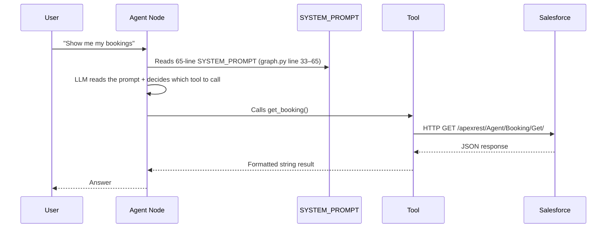

# The Full Picture — Salesforce Skills Explained

## Part 1 — How Your System Works RIGHT NOW

Let's trace exactly what happens when a user sends a message like:
> *"Show me my bookings"*



### The Key File: `graph.py` — The `SYSTEM_PROMPT`

Look at lines 33–65 of [`graph.py`](file:///home/akhilsaini/Advance_RAG_Chatbot/src/graph/graph.py#L33-L65).

This is a **65-line text block** that tells the LLM:
- What tools exist
- When to use each tool
- How to behave for updates
- What NOT to do

```python
SYSTEM_PROMPT = """You are an intelligent travel enterprise assistant.
...
3. Bookings: When the user asks about bookings, or wants to see/modify a booking,
   CALL `get_booking` immediately (with NO arguments to fetch all user bookings,
   or with a specific booking number/ID if provided).
   NEVER ask the user to provide an ID or Name first — fetch their bookings automatically...
...
"""
```

**This prompt is the problem.** Every new Salesforce feature = more lines here. More lines = higher chance the LLM misreads, misinterprets, or ignores a rule.

---

## Part 2 — What "LLM Reads a Prompt" Actually Means

When the agent runs, on **every single user message**, it does this:

```python
# graph.py line 130
invoke_messages = [SystemMessage(content=SYSTEM_PROMPT)] + messages
response = await llm_with_tools.ainvoke(invoke_messages)
```

The LLM receives:
1. The 65-line system prompt (every time)
2. All previous messages (grows with conversation)
3. The user's new message

The LLM then has to **read all of this** and **decide** what to do. It's like giving a new employee a 10-page manual and expecting them to follow it perfectly on every task. As the manual grows → mistakes happen.

---

## Part 3 — What Are "Skills / Structured Tools" and Why Are They Different?

### What You Have Now: Docstring-based "instructions"

Look at your [`salesforce_tools.py`](file:///home/akhilsaini/Advance_RAG_Chatbot/src/tools/salesforce_tools.py#L19-L28):

```python
@tool
async def search_salesforce_opportunities(search: str, config: RunnableConfig) -> str:
    """
    Search for Salesforce Opportunities (deals).
    Use this tool when the user asks about their Salesforce deals,
    opportunities, or amounts.

    Args:
        search: A specific company name or deal name to search for (e.g. 'Acme').
                Leave blank to fetch the most recent deals.
    """
```

This docstring IS how the LLM "sees" the tool. When you call `llm.bind_tools(tools)`, LangChain converts these docstrings + function signatures into a **JSON schema** and sends it to the LLM alongside the system prompt.

The LLM sees something like this under the hood:
```json
{
  "name": "search_salesforce_opportunities",
  "description": "Search for Salesforce Opportunities (deals). Use this tool when...",
  "parameters": {
    "type": "object",
    "properties": {
      "search": {
        "type": "string",
        "description": "A specific company name..."
      }
    }
  }
}
```

So tools are ALREADY being converted to structured JSON schemas. The docstrings are just informal descriptions that become the `"description"` field.

### What "Built-in Skills" Means

**A "skill" = a precisely defined tool that tells the LLM EXACTLY:**
1. When to call it (tight description, no ambiguity)
2. What to pass in (typed Pydantic schema, not free text description)
3. What it will return (documented output format)

Instead of the LLM reading prose instructions and *deciding* — it reads a JSON schema and *executes*.

---

## Part 4 — The Actual Problem in Your Codebase

### Problem 1: Duplicated instructions (prompt + docstring)

**In `SYSTEM_PROMPT` (graph.py line 50):**
```
3. Bookings: When the user asks about bookings... CALL `get_booking` immediately
   (with NO arguments to fetch all user bookings)...
   NEVER ask the user to provide an ID or Name first...
```

**In the tool's docstring:**
```
# This same rule should be IN the tool description, not in the system prompt
```

The instruction lives in the SYSTEM_PROMPT as prose. If the LLM misreads line 50 among 65 lines of other instructions, it will ask the user for a booking ID. That's a hallucination failure.

### Problem 2: The system prompt grows linearly with features

You have 9 tools listed. If you add 5 more Salesforce objects (Cases, Contacts, Leads, etc.), your prompt becomes 100+ lines. The LLM starts making "middle-of-the-document" errors — it reads the beginning and end well, but misses instructions in the middle.

### Problem 3: The `update_booking` tool has no typed constraint

Currently the update tools accept free-form `update_fields: dict`. The LLM has to infer what keys to pass. It can hallucinate field names.

---

## Part 5 — What the Fix Looks Like (Concretely)

### Fix 1: Move per-tool instructions INTO the tool description

**Before (instruction buried in 65-line SYSTEM_PROMPT):**
```python
SYSTEM_PROMPT = """
...
3. Bookings: When the user asks about bookings, CALL `get_booking` immediately
   with NO arguments to fetch all user bookings...
   NEVER ask the user for an ID first...
...
"""
```

**After (instruction lives IN the tool — zero prose in system prompt needed):**
```python
@tool
async def get_booking(booking_id: Optional[str] = None) -> str:
    """
    Fetch booking(s) for the current user.
    - Call with NO arguments to fetch ALL user bookings automatically.
    - Call with booking_id (e.g. 'BK-000001') to fetch one specific booking.
    NEVER ask the user for a booking ID first. Always fetch first, then ask to confirm.
    """
```

Now this instruction is part of the tool schema. The LLM reads it ONLY when it decides to use this tool — not alongside 64 other lines about payments and opportunities.

### Fix 2: Pydantic schemas to eliminate hallucinated field names

**Before (dict = anything goes, LLM guesses field names):**
```python
async def update_booking(booking_id: str, update_fields: dict) -> dict:
    """Update a Booking record."""
```

**After (only valid fields are expressible):**
```python
from pydantic import BaseModel, Field
from typing import Optional, Literal

class UpdateBookingInput(BaseModel):
    booking_id: str = Field(description="18-char Salesforce ID. Get this from get_booking first.")
    status: Optional[Literal["Confirmed", "Cancelled", "Pending"]] = Field(
        None, description="New booking status"
    )
    notes: Optional[str] = Field(None, description="Notes to add to the booking")

@tool("update_booking", args_schema=UpdateBookingInput)
async def update_booking_tool(booking_id: str, status=None, notes=None):
    """Request a booking update (requires user approval before writing)."""
```

Now the LLM literally **cannot** pass `booking_status` (wrong name) or invent a field. The JSON schema enforces it. Hallucinated field names = impossible.

### Fix 3: Shrink the SYSTEM_PROMPT to just role + boundaries

**Before (65 lines, detailed tool instructions mixed in):**
```
You are a travel assistant.
Tool 1: search_documents — use for...
Tool 2: search_salesforce_opportunities — use when...
...
BEHAVIORAL GUIDELINES:
...
```

**After (8–10 lines, role + hard rules only):**
```
You are a travel enterprise assistant. Use the available tools to answer questions.
Always fetch records before updating them. Never fabricate Salesforce IDs.
Decline requests outside your tools. Base answers on tool results only.
```

The tool-specific routing logic moves INTO each tool's description. The system prompt shrinks from 65 lines to ~10.

---

## Part 6 — What Salesforce Agentforce Is (The Platform Option)

This is separate from what's above. Salesforce itself has built an AI agent platform called **Agentforce**.

Think of it like this:
```
YOUR CURRENT SETUP:
User → Your LangGraph Agent → Your Tools → Salesforce REST API

AGENTFORCE OPTION:
User → Your LangGraph Agent → Salesforce Agentforce (handles actions natively)
                                    ↓
                           Salesforce runs Apex, Flows, approvals internally
```

In Agentforce, you define **Topics** (like "Booking Management") and **Actions** (like "Update Booking Status"). Salesforce's Einstein LLM picks the right action. Your code just calls one Agentforce session API instead of maintaining individual tool definitions.

**When to use it:** Only if your Salesforce org already has Agentforce enabled AND your action logic is complex enough that maintaining it in Apex/Flow (Salesforce-native) makes more sense than Python tools.

**For your project right now:** Not needed. Your Python tools + LangGraph are the right layer.

---

## Part 7 — Full Picture: Before vs After

````carousel
### BEFORE (Current State)
```
System Prompt (65 lines of prose)
    ↓ LLM reads ALL of it every turn
    ↓ Decides routing via prose rules
    ↓ Guesses tool params from descriptions
    
Problems:
- Instruction drift (LLM misses rules in long prompt)
- Hallucinated params (no schema enforcement)
- Duplicated logic (same rule in prompt AND docstring)
- Prompt grows with every new SF object
```
<!-- slide -->
### AFTER (With Structured Skills)
```
System Prompt (~10 lines: role + hard limits)
    ↓ LLM reads minimal context
    ↓ Routing via tool selection (JSON schema)
    ↓ Params enforced by Pydantic models
    
Benefits:
- Each tool carries its own precise instructions
- Schema prevents hallucinated field names
- System prompt stays small forever
- Adding new SF objects = add one new @tool
```
````

---

## Part 8 — What You Should Do (In Order)

| Step | What | Where | Time |
|------|------|--------|------|
| 1 | Move per-tool guidance from `SYSTEM_PROMPT` into each tool's docstring | [`graph.py`](file:///home/akhilsaini/Advance_RAG_Chatbot/src/graph/graph.py#L33-L65) + [`salesforce_tools.py`](file:///home/akhilsaini/Advance_RAG_Chatbot/src/tools/salesforce_tools.py) | 0.5 day |
| 2 | Add Pydantic `args_schema` to update tools (booking, payment, package) | [`salesforce_tools.py`](file:///home/akhilsaini/Advance_RAG_Chatbot/src/tools/salesforce_tools.py) | 1 day |
| 3 | Shrink `SYSTEM_PROMPT` to role + 3–4 hard rules only | [`graph.py`](file:///home/akhilsaini/Advance_RAG_Chatbot/src/graph/graph.py#L33-L65) | 1 hour |
| 4 | Evaluate Agentforce (only if SF-side complexity grows) | Research spike | Future |

Steps 1–3 are pure refactor — no new dependencies, no architecture change. The agent will be more reliable immediately.
