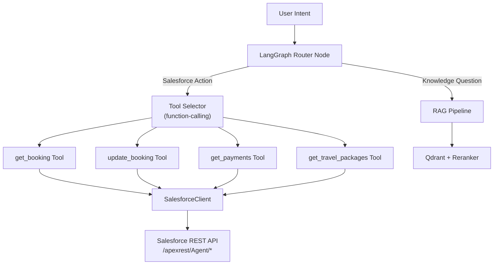

# Salesforce Built-in Skills for LLM Agents — Analysis

## The Problem You're Solving

Your current architecture has LLM agents driven by **long text prompts** that describe what to do with Salesforce (bookings, travel packages, payments). As scope grows:

- Prompts grow → token cost ↑, reliability ↓
- More prose = more surface area for hallucination
- Instruction drift: the LLM "interprets" instead of "executes"

The fix: **replace prose instructions with structured tool/skill definitions** so the LLM *selects and calls* a well-typed function instead of free-text reasoning its way to an API call.

---

## What "Salesforce Built-in Skills" Means

Two overlapping concepts here — pick based on your setup:

### Option A — Salesforce Agentforce (Native Platform)
Salesforce's own AI agent platform. You define **Actions** (Apex, Flow, API calls, Prompt Templates) and **Topics** (scoped intent clusters). Einstein picks the right Action from the Topic based on the user intent — no mega-prompt needed.

### Option B — LangChain Tools / Structured LangGraph Nodes (Your Stack)
Since you're on LangGraph + LangChain, a "skill" = a **typed `@tool`** that the LLM calls via function-calling. The LLM sees a JSON schema (name, description, parameters) — not prose. This is already partially done in your [`salesforce_tools.py`](file:///home/akhilsaini/Advance_RAG_Chatbot/src/tools/salesforce_tools.py).

### Option C — Hybrid: Your Agent + Salesforce Agentforce Actions API
Your LangGraph agent calls Salesforce's **Agent API** to invoke Agentforce sessions, combining your RAG layer with Salesforce's native actions.

---

## Your Current State

```
src/
├── clients/salesforce_client.py   ← Raw API calls (get_booking, update_booking, etc.)
├── tools/salesforce_tools.py      ← LangChain @tool wrappers (partially)
├── graph/
│   ├── nodes.py                   ← LangGraph nodes (RAG flow)
│   └── graph.py                   ← Graph wiring
```

You already have the **client layer** and **tool layer**. The problem is likely:
- Tools have verbose docstrings acting as mini-prompts
- Graph nodes may route via prose logic instead of typed conditions
- No scoped "topic" grouping for Salesforce actions

---

## Recommended Approach



### Step 1 — Tighten Tool Schemas (Highest ROI, Do First)

Replace prose in tool docstrings with **compact, precise descriptions**. The LLM reads these as the "skill definition."

```python
# BAD — prose instruction
@tool
def get_booking(username: str, booking_id: str) -> dict:
    """
    This tool is used to retrieve booking information from Salesforce.
    You should use this when the user asks about their booking, wants to
    see booking details, needs confirmation numbers, etc...
    """

# GOOD — structured intent signal
@tool
def get_booking(username: str, booking_id: Optional[str] = None) -> dict:
    """Fetch booking(s) for user. Pass booking_id to get one; omit for all."""
```

Short + precise → LLM selects correctly, rarely hallucinates parameters.

### Step 2 — Add Pydantic Input Schemas

Typed schemas eliminate argument hallucination entirely:

```python
from pydantic import BaseModel, Field

class UpdateBookingInput(BaseModel):
    booking_id: str = Field(description="18-char Salesforce record ID")
    status: Optional[str] = Field(None, description="New status value")
    notes: Optional[str] = Field(None, description="Agent notes to append")

@tool("update_booking", args_schema=UpdateBookingInput)
async def update_booking_tool(booking_id: str, status=None, notes=None) -> dict:
    """Update a booking's status or notes."""
    ...
```

LLM gets a JSON schema — not a paragraph. Zero ambiguity.

### Step 3 — Scope Tools into a ToolNode (LangGraph native)

```python
from langgraph.prebuilt import ToolNode

salesforce_tools = [get_booking, update_booking, get_payments, get_travel_packages]
tool_node = ToolNode(salesforce_tools)
```

Wire this into the graph as a dedicated Salesforce action branch — separate from RAG.

### Step 4 (Optional) — Salesforce Agentforce Actions API

If your Salesforce org has Agentforce enabled, you can call Salesforce's **Agent API** directly:

```
POST /einstein/ai-assist/v1/agents/{agentId}/sessions
POST /einstein/ai-assist/v1/agents/{agentId}/sessions/{sessionId}/messages
```

Your LangGraph agent becomes the orchestrator; Salesforce handles action execution natively (triggers, flows, approvals). Good if Salesforce-side logic is complex.

---

## Impact on Your Project

| Area | Effect |
|------|--------|
| Prompt length | ↓ 60–80% — descriptions replace paragraphs |
| Hallucination risk | ↓ significantly — LLM picks from typed schema, not free text |
| Token cost | ↓ per-call — shorter system prompts |
| Debuggability | ↑ — tool call logs are structured JSON, not free text |
| Salesforce coupling | ↑ slightly — tighter schema = tighter API contract |
| Code complexity | Neutral — replaces prose with Pydantic models |

---

## Pros

- **Hallucination floor drops**: LLM can't invent a parameter that isn't in the schema
- **Deterministic routing**: function-calling is more reliable than "decide based on the question"
- **Smaller prompts**: schema description < 20 tokens vs prose description 100+ tokens
- **Testable**: tool inputs/outputs are typed — easy to unit test
- **LangSmith/observability friendly**: tool calls log cleanly as structured traces
- **Composable**: skills can be shared across multiple graph flows

## Cons

- **Schema rigidity**: if Salesforce API changes, Pydantic models need updating
- **Limited expressiveness**: some complex conditional logic still needs prose guidance (but isolated in one place — the router)
- **Agentforce lock-in** (if you go Option C): deeper Salesforce dependency, harder to switch LLM providers
- **Initial migration effort**: existing tools need refactoring to tight schemas

---

## What NOT to Do

> [!CAUTION]
> Don't put Salesforce field names, SOQL logic, or API endpoint decisions **inside the prompt**. Once that complexity is in the prompt, it drifts with every model upgrade. Put it in the tool implementation.

> [!WARNING]
> Don't split one logical action into multiple tools just to seem modular. `get_booking` should handle both "one booking" and "all bookings" via optional params — not two separate tools the LLM must choose between.

---

## Recommended Priority

```
1. Tighten tool docstrings      → 1 day, immediate hallucination reduction
2. Add Pydantic input schemas   → 1–2 days, eliminates param hallucination  
3. Wire ToolNode in graph       → 1 day, clean RAG vs action routing
4. Evaluate Agentforce API      → research spike, only if SF-side logic is complex
```

Steps 1–3 stay entirely in your current stack (LangGraph + LangChain). No new dependencies.
