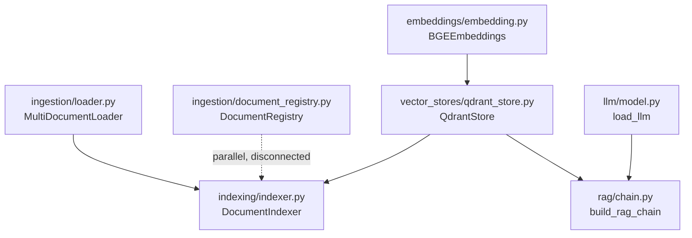
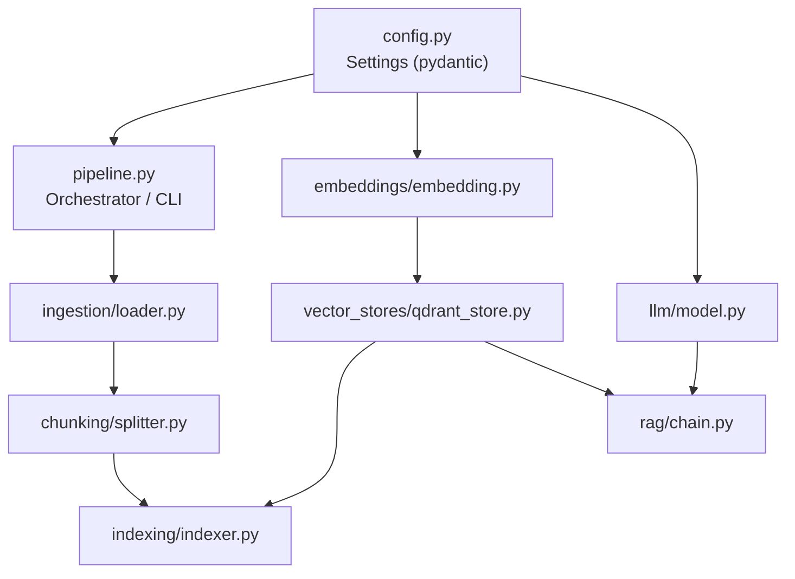

# Advance RAG MultiDoc Chatbot — Comprehensive Review

---

## 1. Code Quality & Bugs

### 🔴 Critical Bugs

#### 1.1 `search_kwargs` parameter silently ignored
**File:** [qdrant_store.py](file:///home/akhilsaini/Advance_RAG_Chatbot/src/vector_stores/qdrant_store.py#L47-L57)

`as_retriever()` accepts `search_kwargs` but hardcodes `{"k": 4}`, ignoring whatever the caller passes. This means any attempt to tune retrieval (top-k, score threshold, filters) from outside is silently discarded.

**Strategy:** Use `search_kwargs or {"k": 4}` so the caller's value takes precedence with a sensible default fallback.

---

#### 1.2 Duplicate hashing logic across two systems
**Files:** [indexer.py](file:///home/akhilsaini/Advance_RAG_Chatbot/src/indexing/indexer.py#L33-L51) and [document_registry.py](file:///home/akhilsaini/Advance_RAG_Chatbot/src/ingestion/document_registry.py#L53-L72)

Both `DocumentIndexer` and `DocumentRegistry` independently implement SHA-256 hashing — one hashes *content strings*, the other hashes *file bytes*. Two parallel change-detection systems that don't communicate create a split-brain risk: the registry says "unchanged" but the indexer sees new content (or vice versa).

**Strategy:** Pick one authoritative source of truth for change detection. The `SQLRecordManager` in `DocumentIndexer` already does this via LangChain's `index()` function with incremental cleanup. `DocumentRegistry` is likely redundant.

---

#### 1.3 `datetime.utcnow()` is deprecated
**File:** [document_registry.py](file:///home/akhilsaini/Advance_RAG_Chatbot/src/ingestion/document_registry.py#L115)

`datetime.utcnow()` has been deprecated since Python 3.12. It returns a naive datetime, which causes subtle bugs across timezones.

**Strategy:** Replace with `datetime.now(datetime.UTC).isoformat()`.

---

#### 1.4 `load_directory()` swallows non-ValueError exceptions
**File:** [loader.py](file:///home/akhilsaini/Advance_RAG_Chatbot/src/ingestion/loader.py#L100-L105)

The `except ValueError` block only catches unsupported file types. If a PDF is corrupted and `PyPDFLoader` raises an `IOError`, `RuntimeError`, or any other exception, it propagates unhandled and aborts the entire directory load — losing all previously-loaded documents in memory (since they haven't been persisted yet).

**Strategy:** Catch `Exception`, log the error with traceback, and continue. Better yet, yield documents incrementally instead of accumulating in a list.

---

#### 1.5 No chunking/splitting in the source code
**File:** [chain.py](file:///home/akhilsaini/Advance_RAG_Chatbot/src/rag/chain.py)

Notebooks `02_chunking.ipynb` exist, but there's no `TextSplitter` integration in the `src/` pipeline. If documents are indexed without splitting, entire multi-page PDFs become single vectors — destroying retrieval precision and likely exceeding embedding model token limits.

**Strategy:** Add a `TextSplitter` step (e.g., `RecursiveCharacterTextSplitter`) between ingestion and indexing in the pipeline.

---

### 🟡 Medium Issues

#### 1.6 `torch` imported unconditionally in embedding module
**File:** [embedding.py](file:///home/akhilsaini/Advance_RAG_Chatbot/src/embeddings/embedding.py#L1)

`import torch` at module level means any import of the embeddings package loads the entire PyTorch runtime (~2 GB memory). This hurts cold-start time and prevents running lightweight components (loader, registry) without GPU dependencies.

**Strategy:** Lazy-import torch inside the `__init__` method, or restructure so ingestion doesn't pull in embedding deps.

---

#### 1.7 SQLite record manager path is relative and uncontrolled
**File:** [indexer.py](file:///home/akhilsaini/Advance_RAG_Chatbot/src/indexing/indexer.py#L20)

`db_url="sqlite:///record_manager.db"` creates the database in whatever the current working directory happens to be. Running from different directories creates orphan databases, causing re-indexing of already-indexed documents.

**Strategy:** Derive the path from a project-level config or place it alongside the vector store data.

---

#### 1.8 Model ID hardcoded with no override path
**File:** [model.py](file:///home/akhilsaini/Advance_RAG_Chatbot/src/llm/model.py#L13)

`MODEL_ID = "Qwen/Qwen3-4B-Instruct-2507"` is a module-level constant. Switching models requires editing source code.

**Strategy:** Accept `model_id` as a parameter to `load_llm()`, defaulting to the current value.

---

#### 1.9 Custom dataclasses `Document` and `Chunk` are unused
**Files:** [document.py](file:///home/akhilsaini/Advance_RAG_Chatbot/src/models/document.py), [chunk.py](file:///home/akhilsaini/Advance_RAG_Chatbot/src/models/chunk.py)

These models define `Document` and `Chunk` dataclasses, but the entire pipeline uses LangChain's `langchain_core.documents.Document` instead. This is dead code.

**Strategy:** Either remove them or integrate them as the canonical internal representation with explicit conversion to/from LangChain Documents at boundaries.

---

### 🟡 Security Concerns

#### 1.10 No secret management
API keys (`api_key` in `QdrantStore`) flow as plain strings. No `.env` loading mechanism (`python-dotenv` or equivalent) exists in the source. The `.gitignore` blocks `.env` files, but nothing reads them.

**Strategy:** Add `python-dotenv` and load secrets from environment variables. Never accept secrets as constructor defaults.

#### 1.11 Unpinned dependencies
**File:** [requirements.txt](file:///home/akhilsaini/Advance_RAG_Chatbot/requirements.txt)

Only `bitsandbytes>=0.46.1` has any version constraint. All other dependencies are unpinned. A `pip install` tomorrow could pull breaking versions of `langchain` (which releases breaking changes frequently).

**Strategy:** Pin exact versions with `pip freeze > requirements.txt` or use a lockfile (`pip-tools`, `poetry.lock`, `uv.lock`).

---

## 2. Architecture & Design

### Current Structure

### 2.1 Missing orchestration layer

There's no pipeline coordinator. The notebooks serve as the glue — meaning the "application" only exists as Jupyter cells. There's no `main.py`, no CLI, no API server that ties ingestion → chunking → embedding → indexing → retrieval → generation together.

**Strategy:** Create a thin orchestrator (e.g., `src/pipeline.py`) or a CLI entry point that wires components together. This is the single highest-impact architectural change.

---

### 2.2 No chunking module in `src/`

The notebook `02_chunking.ipynb` presumably handles text splitting, but no reusable chunking component exists in the source tree. This is a gap between notebook experimentation and productionizable code.

**Strategy:** Add `src/chunking/splitter.py` wrapping `RecursiveCharacterTextSplitter` with project-specific defaults (chunk size, overlap, separators).

---

### 2.3 `DocumentRegistry` duplicates `SQLRecordManager`

LangChain's `index()` with `SQLRecordManager` already provides idempotent, incremental indexing with change detection. `DocumentRegistry` reimplements this at the file level with JSON persistence. Two change-tracking systems = two sources of truth = bugs.

**Strategy:** Drop `DocumentRegistry` or repurpose it as a lightweight "which files have I seen" cache that feeds into the indexer — but don't use it for change detection.

---

### 2.4 `BGEEmbeddings` is a trivial wrapper

`BGEEmbeddings` wraps `HuggingFaceEmbeddings` adding only device detection. It could be a factory function instead of a class. The wrapper obscures the LangChain interface it delegates to.

**Strategy:** Replace with a `create_embeddings(model_name, device) -> Embeddings` factory function. Simpler, more transparent, same result.

---

### 2.5 No configuration management

Settings are scattered across default parameter values in multiple files:
- Collection name: `"multidoc_rag"` in [qdrant_store.py](file:///home/akhilsaini/Advance_RAG_Chatbot/src/vector_stores/qdrant_store.py#L18) and [indexer.py](file:///home/akhilsaini/Advance_RAG_Chatbot/src/indexing/indexer.py#L21)
- Model ID: [model.py](file:///home/akhilsaini/Advance_RAG_Chatbot/src/llm/model.py#L13)
- DB URL: [indexer.py](file:///home/akhilsaini/Advance_RAG_Chatbot/src/indexing/indexer.py#L20)
- Data directory: [loader.py](file:///home/akhilsaini/Advance_RAG_Chatbot/src/ingestion/loader.py#L14)

**Strategy:** Single `config.py` or Pydantic `Settings` class that reads from env vars / `.env` / config file. All components receive their config from one place.

---

### Recommended Architecture (Target State)

---

## 3. Enterprise-Level Readiness Checklist

| Category | Status | Notes |
|---|---|---|
| **Entry point / API** | ❌ Missing | No `main.py`, CLI, or HTTP server. App only runs via notebooks. |
| **Configuration management** | ❌ Missing | Hardcoded defaults scattered across files. No env var support. |
| **Secret management** | ❌ Missing | No `.env` loading, no vault integration, API keys as plain args. |
| **Error handling** | 🟡 Minimal | Happy path only. No retries, no graceful degradation, limited exception catching. |
| **Logging** | ❌ Missing | Uses `print()` statements. No `logging` module, no structured logs. |
| **Observability** | ❌ Missing | No metrics, no tracing, no health checks. |
| **Testing** | ❌ Missing | `tests/` directory exists but is empty. Zero test coverage. |
| **CI/CD** | ❌ Missing | No GitHub Actions, no pipeline config, no linting config. |
| **Containerization** | ❌ Missing | No `Dockerfile`, no `docker-compose.yml`. |
| **Dependency management** | 🟡 Weak | Unpinned `requirements.txt`. No lockfile. |
| **Documentation** | ❌ Missing | Empty `README.md`. No API docs, no setup guide. |
| **Data pipeline idempotency** | 🟡 Partial | `SQLRecordManager` provides it, but `DocumentRegistry` creates parallel tracking. |
| **Scalability** | 🟡 Limited | Qdrant supports clustering, but in-memory document accumulation in `load_directory()` won't scale to large corpora. |
| **Code organization** | ✅ Good | Clean module separation. Proper `__init__.py` exports in `llm/`. |
| **Gitignore hygiene** | ✅ Good | Secrets, data, caches, model weights all excluded. |

---

### Enterprise Readiness Grade: **D+**

**Breakdown:**

| Area | Grade | Weight | Rationale |
|---|---|---|---|
| Code correctness | C | 20% | Functional but has silent bugs (ignored kwargs, missing chunking). |
| Architecture | C+ | 20% | Reasonable separation, but no orchestrator, no config layer, dead code. |
| Security | D | 15% | No secret management, unpinned deps, no input validation. |
| Testing | F | 15% | Zero tests. |
| Ops readiness | F | 15% | No Docker, CI/CD, logging, or monitoring. |
| Documentation | F | 15% | Empty README, no setup instructions. |

> [!NOTE]
> This is a solid **learning/prototyping** project with good structural instincts (module separation, `.gitignore`, data models). The D+ reflects enterprise-readiness criteria, not code quality for a personal project. The foundations are right — the gap is in the production hardening layer.

---

## Priority Action Items (Ordered by Impact)

| Priority | Action | Effort |
|---|---|---|
| **P0** | Add text chunking to the `src/` pipeline | Small |
| **P0** | Fix `as_retriever()` to use caller's `search_kwargs` | Trivial |
| **P1** | Create `config.py` with Pydantic Settings + `.env` loading | Small |
| **P1** | Add orchestrator entry point (`main.py` or CLI) | Medium |
| **P1** | Pin all dependency versions | Trivial |
| **P2** | Replace `print()` with `logging` module | Small |
| **P2** | Write unit tests for indexer, loader, chain | Medium |
| **P2** | Remove dead code (`models/document.py`, `models/chunk.py`) or integrate it | Trivial |
| **P2** | Remove or consolidate `DocumentRegistry` | Small |
| **P3** | Add Dockerfile + docker-compose | Medium |
| **P3** | Add CI pipeline (lint + test) | Small |
| **P3** | Write README with setup/usage instructions | Small |
